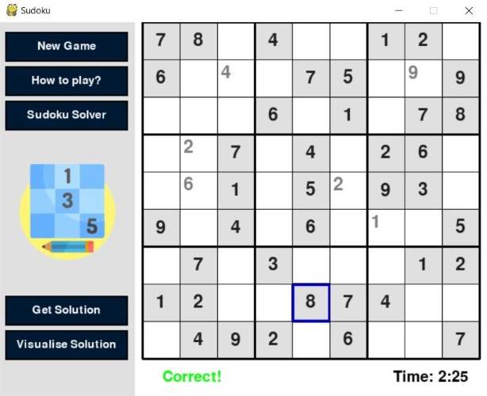

# Sudoku
This is a sudoku game in python using backtracking algorithm.
User can select a cell and enter the number of their choice. Initially the number is only displayed and can be placed in the cell by pressing enter.

If the input is correct, the number gets placed in the cell otherwise number gets erased and an 'Incorrect' message is shown.

##How to play
To play this game, you need to have Pygame installed.
Download the code and run the file game.py to start playing.
